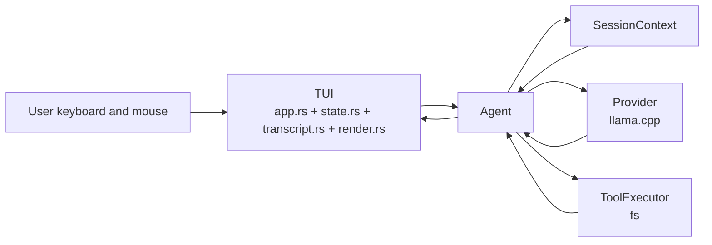
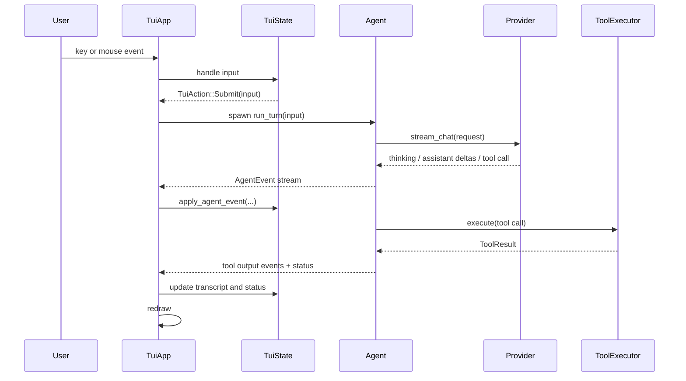

# TUI architecture

This document explains how Glass's TUI works for contributors reading or changing the frontend. It focuses on runtime flow, module boundaries, and the interfaces the TUI consumes from the rest of the application.

## Role in the application

The TUI is the only v1 frontend. It owns terminal setup, input handling, redraws, transcript presentation, and local UI behavior such as scrolling and fold toggles. It does **not** own agent planning, provider communication, tool execution, or context management logic. Those stay behind the `Agent` boundary.

## Startup and shutdown

`main.rs` builds the runtime stack in this order:

1. Load config.
2. Resolve the startup directory from the current working directory.
3. Construct the provider and validate it.
4. Construct the `fs` tool executor scoped to the startup directory.
5. Construct `SessionContext`.
6. Construct `Agent`.
7. Hand control to `TuiApp::run()`.

`TuiApp::run()` enters raw mode, switches to the alternate screen, enables mouse capture, and creates a Ratatui terminal. A `TerminalGuard` restores the terminal on exit.

## Main runtime flow

`tui/app.rs` owns the event loop. The loop has three repeated steps:

1. Drain queued app events from the background turn task.
2. Draw the current frame.
3. Poll for terminal input and convert it into `TuiAction`s.

When the user submits input, `TuiApp` spawns a Tokio task that locks the `Agent`, runs a turn, forwards streamed `AgentEvent`s through an unbounded channel, then sends a fresh `AgentStatus` snapshot and any pending `HarnessCommand`.

## Module breakdown

### `tui/app.rs`

`TuiApp` is the integration layer between terminal I/O and the agent.

Key responsibilities:

- own the Crossterm event loop
- spawn background turn execution
- receive `AgentEvent`, `AgentStatus`, and `HarnessCommand`
- compute layout before each draw
- render the transcript, composer, and status line
- place the terminal cursor in the composer

Important internal boundaries:

- **Input path:** `event::read()` -> `TuiState::handle_key_event()` / `handle_mouse()`
- **Agent path:** `spawn_turn()` -> `Agent::run_turn()` -> channel back into `handle_app_event()`
- **Draw path:** `compute_draw_layout()` -> `render_draw_layout()`

`TuiApp` keeps only a small amount of frontend state itself: the startup directory for display, the transcript rectangle for hit-testing, and the exit flag. Most UI state lives in `TuiState`.

### `tui/state.rs`

`TuiState` is the top-level UI state container. It owns:

- the current composer text
- whether a turn is in flight
- the last `AgentStatus`
- the nested `TranscriptState`

Its main job is translating input and agent events into state changes:

- `handle_key_event()` turns keys into `TuiAction`
- `apply_agent_event()` updates turn state and forwards transcript changes
- `sync_transcript_selection_to_view()` keeps the selected foldable entry visible
- `handle_transcript_mouse()` applies mouse-wheel scrolling and click-to-toggle behavior

`TuiState` does not talk to the provider or tools directly. It only reacts to typed events from the agent layer.

### `tui/transcript.rs`

`TranscriptState` owns the transcript data model and transcript-specific behavior.

Entry types:

- `User`
- `Thinking`
- `Assistant`
- `ToolStatus`
- `ToolOutput`
- `Error`

The transcript is append-oriented. Streaming updates reuse the most recent active entry when possible:

- assistant deltas extend the current `Assistant` entry for the turn
- thinking deltas extend the current `Thinking` entry until `ThinkingDone`
- `ToolStarted` inserts `ToolStatus`
- tool output deltas upgrade `ToolStatus` to `ToolOutput` and then append body chunks

Completed `Thinking` and `ToolOutput` entries can be folded. Folding is controlled by transcript-local state, not by the agent.

Selection and navigation also live here:

- `Up` and `Down` move among foldable entries
- `Enter` toggles the selected entry when the composer is empty
- mouse clicks toggle the entry at the clicked transcript line
- scrolling is line-based and clamped to the rendered transcript height

### `tui/render.rs`

`render.rs` holds shared layout and text-wrapping helpers. It contains no agent logic and no persistent UI state.

Important helpers:

- `layout_chunks()` splits the frame into transcript, composer, and status areas
- `composer_block()` and `composer_paragraph()` build the composer widget
- `composer_cursor_position()` computes the visible cursor location from wrapped composer text
- `wrap_composer_text()` applies the same whitespace-aware wrapping rules used by composer height and cursor math
- `wrap_plain_text()` wraps transcript content for display
- `should_fold_tool_output()` decides whether tool output or completed thinking starts folded
- `compose_status_line()` formats model and token usage data for the status bar

The key invariant in this file is that the composer widget, composer height calculation, and cursor placement must agree on wrapping behavior.

### `tui/tests.rs`

`src/tui/tests.rs` is the regression suite for frontend behavior. It covers:

- keyboard shortcuts and composer submission rules
- status-line formatting
- layout sizing
- composer wrapping and cursor placement
- transcript folding, selection, and scrolling
- mouse interactions
- reset and exit handling
- rendering of assistant, tool, thinking, and error entries

The tests exercise `TuiState`, `TranscriptState`, and Ratatui rendering helpers directly rather than driving a full interactive terminal session.

## Service interaction surfaces

The TUI depends on the rest of the application through a small set of typed surfaces.

### Agent surface

`tui/app.rs` consumes:

- `Agent::run_turn()`
- `Agent::status_snapshot()`
- `Agent::take_pending_command()`
- `AgentEvent`
- `AgentStatus`
- `HarnessCommand`

This is the TUI's main application boundary. The TUI does not build provider requests, execute tools, or prune context itself.

### Provider surface

The TUI has no direct dependency on `llm/llama_cpp.rs`. Provider output reaches the frontend only after the agent converts it into `AgentEvent`s such as:

- `ThinkingDelta`
- `AssistantDelta`
- `ToolStarted`
- `ToolOutputDelta`
- `ToolFinished`
- `AssistantDone`
- `TurnError`

This keeps provider protocol details out of the TUI code while still allowing streamed display.

### Tool surface

The TUI does not call `ToolExecutor` directly. It depends on tool execution indirectly through:

- tool-start events
- streamed tool-output chunks
- tool-finished events
- error events

That separation lets the transcript show tool activity inline without owning tool dispatch.

### Context surface

`AgentStatus` carries context usage data into the status line:

- current estimated context tokens
- configured context limit
- last request token usage when available

The TUI does not read or mutate `SessionContext` directly.

## Input model

Keyboard behavior in `TuiState`:

- `Enter` submits the composer
- `Ctrl+J` inserts a newline
- `Shift+Enter` inserts a newline when reported by the terminal
- `PageUp` / `PageDown` scroll the transcript
- `Up` / `Down` move among foldable transcript entries
- `Ctrl+C` quits immediately

Mouse behavior:

- wheel scrolling over the transcript scrolls by a small fixed number of lines
- left click on a foldable transcript entry toggles expansion

Submission rules:

- whitespace-only composer content is ignored
- while a turn is in flight, normal submission is blocked
- `/exit` is allowed even while a turn is in flight

## Transcript rendering model

The transcript is a single scrolling pane. Each entry renders into one or more wrapped lines, and scroll positions are tracked in rendered line space rather than entry space.

Display conventions:

- user text is prefixed with `You:`
- assistant text is prefixed with `Assistant:`
- thinking renders as `Thinking...` while active and as a foldable `Thinking` block once completed
- running tools render as `Tool <name>: <arguments> - running...`
- completed tools render `Tool <name>: <arguments>` with the body below when expanded
- errors render inline as `Error: ...`

Tool arguments are part of the tool header line, not the tool body.

## Layout and redraw behavior

Each frame is split into:

1. transcript area
2. composer area
3. one-line status area

The composer grows with wrapped content. Before drawing, `TuiApp` probes the inner composer width, asks `TuiState` for the required composer height, recomputes the layout, clamps transcript scroll, and then computes cursor position for the final composer rectangle.

Redraws happen on every loop iteration after queued app events are applied, which lets streamed agent and tool updates appear incrementally in the transcript.

## Local commands

Local slash commands are handled in `agent.rs`, not in the TUI:

- `/exit` sets a pending exit command
- `/new` resets `SessionContext` and starts a fresh session

`TuiApp` applies the resulting `HarnessCommand` by either setting its exit flag or resetting `TuiState`.

## Reading order for contributors

For a top-down read of the frontend, start here:

1. `src/main.rs`
2. `src/tui/app.rs`
3. `src/tui/state.rs`
4. `src/tui/transcript.rs`
5. `src/tui/render.rs`
6. `src/tui/tests.rs`

If you are changing the frontend-agent boundary, read `src/agent.rs` alongside `tui/app.rs` and `tui/state.rs`.
